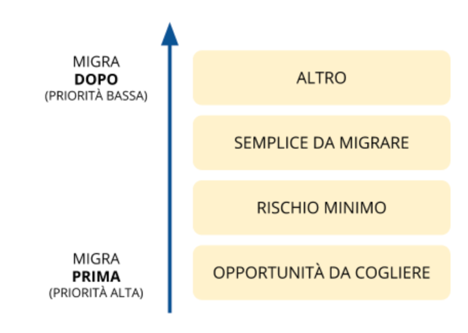

**3.1 Costruire una mappa degli applicativi e dei servizi attivi**
==================================================================

Il primo obiettivo da raggiungere è quello di avere una visione
d’insieme degli applicativi e di classificarli in modo semplice per
poterli prioritizzare ed identificare quelli da cui iniziare, o con cui
procedere, la migrazione al cloud, ovvero quelli che ne traggono
maggiori benefici e pongono minori criticità.

**3.1.1 Lista degli applicativi**
---------------------------------

Il primo passo da compiere è stilare una lista degli applicativi
attualmente in uso (vedi allegato `Lista degli applicativi <https://drive.google.com/open?id=1iVswHZ22zanOSxFoQ8lSW8B1Enx9mg9gQAPVhayerNs>`_), ovvero sia
gli applicativi utilizzati abitualmente che quelli con accessi saltuari
o legati a specifiche necessità. Sono da considerare tutti gli
applicativi che utilizzano l’infrastruttura dell’organizzazione.

Per ogni applicativo è utile tracciare il nome con la versione,
l’interlocutore con cui si interagisce per gestire gli aggiornamenti, le
evoluzioni, ecc. (può essere il produttore stesso dell’applicativo, il
fornitore, includendo altre entità pubbliche come un ministero) e le
eventuali licenze associate (vedi il capitolo 3.1.2).

Ad ogni applicativo è poi utile associare i servizi che supporta e
l’indicazione delle persone di riferimento per tali servizi. Con
applicativo, infatti, si fa riferimento al software o alle componenti
strettamente tecnologiche dell’applicazione. Con servizio, invece, si
intende la prestazione erogata agli utenti, siano questi esterni (ad
es.i cittadini) o interni (ad es. i dipendenti) all’amministrazione. Un
applicativo può dunque supportare uno o più servizi e, viceversa, un
servizio può richiedere uno o più applicativi.

Si consiglia perciò di prestare particolare attenzione alla mappatura
dei servizi sulla lista degli applicativi, in quanto l’amministrazione
dovrà probabilmente considerare di migrare più applicativi per iniziare
ad erogare un servizio con il paradigma cloud.

La costruzione di questo elenco può seguire un approccio iterativo ed
incrementale, in cui si collezionano inizialmente gli applicativi di cui
si ha maggiore evidenza e si integra successivamente la lista con quelli
per i quali è necessaria un’indagine più approfondita per verificarne
l’esistenza e l’utilizzo.

**3.1.2.1 Licenze software**
~~~~~~~~~~~~~~~~~~~~~~~~~~~~

Nella compilazione della lista degli applicativi, risulta utile
riportare anche le informazioni relative alle licenze a loro associate,
in quanto saranno uno dei fattori da considerare nello step di
prioritizzazione. È comunque importante fare attenzione a non
considerare le licenze software come unico driver di prioritizzazione
per la migrazione in cloud (vedi capitolo 3.1.3 per i dettagli).

Le informazioni relative alle licenze da inserire durante la
compilazione della lista degli applicativi sono:

-  tipologia di licenza on-premise e open source

-  data di scadenza contrattuale della licenza

**3.1.2.1.1 Tipologie di licenze on-premise**
^^^^^^^^^^^^^^^^^^^^^^^^^^^^^^^^^^^^^^^^^^^^^

Vi sono diverse tipologie di licenze on-premise, in particolare: 

-    **licenza perpetua**: in passato l’unica opzione disponibile era
     l’acquisto di software su supporto fisico come un floppy o disco
     ottico. Avere un programma su supporto fisico rendeva facile
     installarlo su eventuali nuove macchine. Software di questo tipo
     erano distribuiti tramite una licenza perpetua garantendo al
     titolare la possibilità di usarlo per tutto il tempo che desidera
     senza costi aggiuntivi in base ai termini di contratto di licenza
     con l’utente finale o EULA.
     Questo tipo di licenza è generalmente meno comune oggi, in quanto
     le software house sviluppano i loro programmi con una strategia che
     favorisce un'alta frequenza di aggiornamento solitamente compresa
     nel prezzo.

-    **licenza per sito**: un tipo di licenza software che consente
     all'utente di installare un pacchetto software in più computer
     contemporaneamente, ad esempio in un particolare sito (struttura) o
     in un ente. A seconda dell'importo delle tariffe pagate, la licenza
     può essere illimitata o può limitare l'accesso simultaneo a un
     determinato numero di utenti. Il termine "sito" si intende a
     definire una limitazione sui diritti di accesso dell'utente.
     Al giorno d'oggi, questi tipi di licenze sono rare, ma ancora
     utilizzate in alcuni settori. I venditori possono inserire clausole
     che consentono ai rappresentanti di visitare il sito e verificare
     che l'uso del software confermi la licenza (auditing). Una licenza
     per sito funziona in maniera molto simile a una licenza perpetua
     tranne che si applica a tutti i membri del “sito”. Solitamente il
     prezzo per utente diminuisce con l’aumentare degli utenti.

-    **licenza nominativa**: una licenza per postazione è un modello di
     licenza software basato sul numero di singoli utenti che hanno
     accesso a un servizio o prodotto digitale. Ad esempio, la licenza
     per postazione da 50 utenti permette fino a 50 utenti nominati
     individualmente di accedere al programma.
     Un'alternativa è la licenza utente simultanea, basata sul numero di
     utenti simultanei, indipendentemente da quali individui stiano
     accedendo al programma. Ad esempio, in una licenza di utilizzo
     simultaneo da 50 utenti, dopo che 50 utenti sono connessi al
     programma, il 51° utente viene bloccato. Quando uno dei primi 50 si
     disconnette, l’utente successivo può accedere.

**3.1.2.1.2 Tipologie di licenze open source**
^^^^^^^^^^^^^^^^^^^^^^^^^^^^^^^^^^^^^^^^^^^^^^

Vi sono diverse tipologie di licenze open source e solitamente i
software licenziati in questo modo non hanno particolari restrizioni
quando migrati in cloud.

Per un compendio più completo sui tipi di licenze e sulla loro gestione
per il riuso degli applicativi, rimandiamo al documento `Allegato C:
Guida alle licenze Open
Source <https://docs.italia.it/italia/developers-italia/lg-acquisizione-e-riuso-software-per-pa-docs/it/bozza/attachments/allegato-d-guida-alle-licenze-open-source.html>`__
pubblicato da AgID.

**3.1.3 Prioritizzazione degli applicativi**
--------------------------------------------

Come decidere ora l'ordine con cui migrare le applicazioni nel cloud? È
una domanda molto importante, perché un successo iniziale durante la
migrazione al cloud è fondamentale per continuare il percorso di
adozione del cloud. Viceversa, un insuccesso precoce può pregiudicare la
prosecuzione.

Benché i vantaggi del cloud siano chiari, osservare e analizzare in
dettaglio gli aspetti di ogni applicazione che è stata creata o
implementata nell’organizzazione può essere complicato e dispendioso in
termini di tempo. Sebbene non esista una risposta valida per tutti gli
scenari, esistono alcune buone pratiche che è possibile utilizzare per
iniziare a fare una valutazione di alto livello sull’ordine con cui
migrare gli applicativi. Questo tipo di pianificazione anticipata può
semplificare il processo di migrazione e rendere più fluida l'intera
transizione cloud.

Il seguente framework aiuta ad identificare l’ordine con cui procedere
con la valutazione di dettaglio (vedo 3.2) per la migrazione degli
applicativi. Esso si basa su quattro livelli di priorità come illustrato
nel seguente grafico:

I software con “opportunità da cogliere” hanno una priorità maggiore
rispetto a quelli con “rischio minimo” che a loro volta sono da
privilegiare rispetto agli applicativi “semplici da migrare”. I software
che non rientrano in nessuno dei livelli precedenti sono da considerare
per ultimi.

Identificare per ogni software presente nella lista il livello di
priorità. Tale livello può essere identificato sulla base dei principi
specificati nelle sezioni seguenti ed utilizzando le domande proposte
come esempi. Si raccomanda di considerare i molteplici aspetti che le
domande fanno emergere nell’insieme per valutare l’appartenenza al
livello.

Procedere, per uno specifico applicativo, in modo sequenziale partendo
dal livello di priorità più alta (“opportunità da cogliere”) fino a
quello a priorità più bassa (“altro”). Se il software può essere
considerato per il livello di priorità in esame, si passa
all’applicativo successivo ripartendo dal livello a priorità più alta.

Un applicativo può logicamente ricadere in più livelli: va associato
solo al livello di priorità più alta tra quelli applicabili.

Una volta completata la classificazione degli applicativi sui quattro
livelli, procedere con lo step successivo per gli applicativi
appartenenti al livello di priorità più alto (non necessariamente in
modo contemporaneo).

In caso ad un livello appartengano un numero significativo di
applicativi è raccomandato di iterare la prioritizzazione utilizzando le
dimensioni a priorità inferiore, ad es. se il livello “opportunità da
cogliere” ha decine di applicativi, si può raffinare la prioritizzazione
considerando per ognuno il livello di rischio, identificando quelli a
rischio minimo. Se necessario, si può ulteriormente raffinare dando
priorità, tra quelli con opportunità da cogliere e rischio minimo, a
quelli più facili da migrare.

**3.1.3.1 Livello 1: opportunità da cogliere**
~~~~~~~~~~~~~~~~~~~~~~~~~~~~~~~~~~~~~~~~~~~~~~

Gli applicativi che si consiglia di approfondire per primi per la
migrazione sono quelli che a oggi hanno maggiori opportunità di trarre
vantaggio (soprattutto in termini di costi) dal cloud.

Ecco alcune domande da porsi per identificare gli applicativi
appartenenti a questo livello:

-  Si prevedono significativi risparmi di costi con la migrazione al
   cloud di questo applicativo? Ad es.

   -  La licenza software è in scadenza?

   -  Si può risparmiare sulle spese per le strutture, l’alimentazione
      ed il raffreddamento?

   -  Si può risparmiare sui costi di connettività?

-  È necessaria una soluzione di disaster recovery?

-  Adotta già una soluzione di disaster recovery onerosa?

-  Questo applicativo richiede un aggiornamento hardware imminente che
   rende più interessante il passaggio al cloud prima piuttosto che più
   avanti nel tempo?

-  Questo applicativo richiede un incremento delle risorse hardware?

-  Questo applicativo richiede frequente manutenzione hardware?

-  Ci sono applicativi nel cloud (soluzioni Saas) che renderebbero
   questa applicazione notevolmente migliore?

-  Ci sono requisiti di conformità normativa per questa applicazione non
   ancora soddisfatti che possono essere risolti sul cloud?

Identificare questi applicativi, primi candidati per la migrazione,
permetterà all’amministrazione di ottenere successi rapidi che producono
vantaggi tangibili e immediati per gli utenti e l’organizzazione stessa.

**3.1.3.2 Livello 2: ridurre al minimo il rischio di migrazione**
~~~~~~~~~~~~~~~~~~~~~~~~~~~~~~~~~~~~~~~~~~~~~~~~~~~~~~~~~~~~~~~~~

Laddove il primo livello si concentra sulle opportunità, il secondo
livello si concentra sul rischio. Quali applicazioni puoi spostare con
un rischio relativamente basso per la continuità del servizio? Ci sono
una serie di domande che l'IT può farsi per aiutare a valutare quali
applicazioni sono meno rischiose da migrare, ovvero tra le più
interessanti da migrare nelle prime fasi di un progetto di migrazione
cloud. Per esempio:

-  Qual è la criticità di questa applicazione per l’organizzazione? Qual
   è la sensibilità rispetto ai tempi di inattività? molto importante,
   24x7 mission-critical? moderatamente importante? bassa importanza,
   ambiente dev / test? Guida: gli applicativi con minore criticità
   espongono ad un rischio minore

-  Un alto numero di dipendenti e/o cittadini dipendono da questa
   applicazione? Guida: un minor numero di utilizzatori rappresenta un
   rischio minore

-  Qual è il livello dell’ambiente di questa applicazione (produzione,
   staging, test, sviluppo)? Guida: gli ambienti non di produzione hanno
   un rischio minore

-  Quante dipendenze e/o integrazioni non interoperabili ha questa
   applicazione (ovvero che non utilizzano API)? Guida:
   dipendenze/integrazioni basate su API rappresentano un rischio minore

-  Qual è la conoscenza del team IT di questa applicazione? Guida:
   maggiore è la conoscenza, minore è il rischio

-  Il team IT ha una documentazione completa e aggiornata per questa
   applicazione e la sua architettura? Diagramma di sistema, diagramma
   di rete, diagramma del flusso di dati, documentazione sulla
   build/deploy, documentazione della manutenzione in corso, .. Guida:
   più completa ed aggiornata è la documentazione, minore è il rischio

-  Quali sono i requisiti di conformità normativa per questa
   applicazione? Guida: maggiori requisiti di conformità introducono più
   variabili da controllare, aumentando il rischio

-  Qual è la sensibilità ai tempi di fermo e / o di risposta per questa
   applicazione? Guida: garantire tempi di risposta molto ridotti in
   specifici contesti possono rappresentare un rischio maggiore. Impatto
   elevato in caso di tempi di fermo rappresenta un rischio maggiore.

-  Ci sono responsabili d’area desiderosi e disposti a migrare i loro
   applicativi in anticipo?

Porsi delle domande come quelle in elenco aiuta a classificare le
applicazioni dal rischio più basso al più alto. Le applicazioni a basso
rischio dovrebbero essere migrate per prime e le applicazioni a rischio
più elevato dovrebbero invece essere migrate più tardi.

**3.1.3.3 Livello 3: facilità di migrazione al cloud pubblico**
~~~~~~~~~~~~~~~~~~~~~~~~~~~~~~~~~~~~~~~~~~~~~~~~~~~~~~~~~~~~~~~

Il terzo livello in questo framework ruota attorno alla facilità con cui
è possibile migrare potenzialmente un'applicazione al cloud. A
differenza del rischio, che riguarda l'importanza relativa di tale
applicazione, la facilità di migrazione riguarda il modo in cui il
trasferimento dell'applicazione verso il cloud sarà privo di attriti.
Alcune buone domande da porsi includono:

-  Come è stata sviluppata questa applicazione? Acquisto di terze parti
   da un produttore rilevante (ancora in attività?), acquisto di terze
   parti da un produttore minore (ancora in attività?), scritto in-house
   (autore ancora in organizzazione?), scritto da un partner (ancora
   attivo? Ancora un partner?)

-  Quanto è nuova questa applicazione? È stata progettata per
   l'esecuzione on-premise o nel cloud? Adotta microservizi? È
   multi-tier?

-  È possibile migrare questa applicazione utilizzando approcci semplici
   come lift-and-shift (re-host)? Utilizza macchine virtuali o
   container?

-  Questa applicazione è strettamente dipendente da uno specifico
   sistema operativo o è flessibile rispetto a questo aspetto?

-  Questa applicazione (o i suoi dati) ha requisiti normativi, di
   conformità per l'esecuzione on-premise? Guida: la conformità può
   aumentare la complessità della migrazione

-  Quali sono le considerazioni sui dati per questa app? Sono aggiornati
   di frequente? Ci sono altri sistemi dipendenti da questo set di dati?

Quando si pianificano le applicazioni da migrare nel cloud, è possibile
che a volte applicazioni di Livello 3 possano andare prima del Livello 2
(o anche Livello 1). Questo è assolutamente normale. Livello 2 e Livello
3 implicano molte variabili, quindi è comune avere un po' di scambi
lungo il percorso di migrazione mantenendo comunque il senso logico
della sequenza

**3.1.3.4 Livello 4: altro**
~~~~~~~~~~~~~~~~~~~~~~~~~~~~

Il quarto ed ultimo livello di questo framework raccoglie tutti quegli
applicativi che non hanno un evidente beneficio dalla migrazione al
cloud, rappresentano un rischio significativo nella migrazione per i
servizi che supportano e hanno una complessità specifica nella
migrazione.

Questo tipo di applicativi sono tipicamente applicativi molto
personalizzati o costituiti da soluzioni ad hoc per necessità
particolari, per cui la loro migrazione pone sfide che altri applicativi
di mercato non pongono e per i quali non ci si può affidare a conoscenza
diffusa sul mercato.

Questi applicativi possono essere lasciati in fondo al processo di
migrazione perché la combinazione dei fattori li rende meno appetibili
dal punto di vista del valore generato rispetto agli altri e la
complessità della migrazione richiede un’esperienza consolidata che si
può avere dopo aver completato con successo le migrazioni precedenti.

