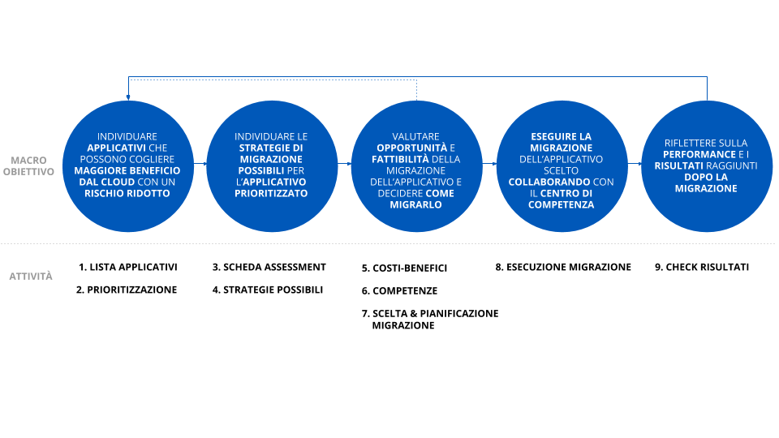
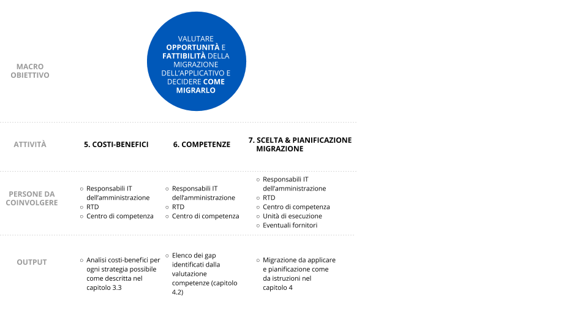

2.3 Roadmap di una migrazione
=============================

La migrazione dell’intero parco applicativo al cloud è un’operazione
complessa che riguarda aspetti tecnologici, di processo e culturali.

È cruciale per il successo dell’operazione iniziare a beneficiare della
nuova architettura durante il percorso, gradualmente, e non solo al
termine dell’intera transizione.

Per raggiungere questo risultato e contestualmente ridurre i rischi
legati a questa sfida, è fondamentale procedere in modo iterativo ed
incrementale partendo dagli applicativi che traggono un beneficio
significativo dall’adozione del paradigma cloud, che al contempo
rappresentano un rischio ridotto per la continua erogazione dei servizi
supportati e che risultano relativamente semplici da migrare.

Questo approccio permette al team di lavoro di scoprire ed affrontare le
problematiche che emergono strada facendo, senza particolari pressioni
legate alla criticità dell’applicativo. La conoscenza che si sviluppa
nel superare queste sfide è poi di supporto quando si devono affrontare
applicativi a rischio maggiore: la conoscenza acquisita con le
migrazioni precedenti infatti riduce il rischio delle migrazioni
successive.

Le migrazioni iniziali devono anche contribuire a creare l’evidenza del
valore del cloud e la fiducia necessaria a procedere con le successive
migrazioni includendo i cambiamenti che possono essere richiesti a
livello di processi, attività o responsabilità.

Riassumendo la strategia di migrazione da adottare in una roadmap,
ovvero in un percorso che permetta di definire in modo chiaro gli
obiettivi di ogni fase, possiamo identificare tre momenti rilevanti:

1. **Ora**: ovvero la fase iniziale focalizzata sulla creazione dei
   primi casi di successo con applicativi scelti secondo specifici
   criteri di prioritizzazione (vedi capitolo 3.1.2)

2. **Subito dopo**: ovvero una seconda fase con obiettivi da conseguire
   a seguito dell’esperienza fatta nella prima fase e degli
   apprendimenti e della conoscenza maturata su: gli aspetti specifici
   della piattaforma cloud selezionata come destinazione, i vincoli
   incontrati e le problematiche specifiche emerse durante la migrazione
   degli applicativi rispetto al contesto di partenza

3. **Più tardi**: ovvero un’ultima fase in cui si va a concludere il
   processo forti dell’esperienza e dei successi conseguiti nelle fasi
   precedenti

Le tre fasi identificate suggeriscono un approccio multi-fase che può
poi essere adattato alle specifiche realtà.

|image0|

+-----------------------+-----------------------+-----------------------+
| OBIETTIVO:            | OBIETTIVO:            | OBIETTIVO:            |
|                       |                       |                       |
| Creare i **primi casi | Sfruttando le         | Concludere la         |
| di migrazione di      | conoscenze maturate   | **migrazione degli    |
| successo** mostrando  | nella fase            | applicativi           |
| il valore che si      | precedente, creare    | rimanenti**, **più    |
| ottiene dalla nuova   | altri **casi di       | rischiosi e più       |
| infrastruttura        | successo con          | complicati** forti    |
|                       | migrazioni che        | delle esperienze      |
|                       | mostrano l’alto       | precedenti            |
|                       | valore dalla          |                       |
|                       | migrazione**, ma      |                       |
|                       | **più impegnative**   |                       |
|                       | dal punto di vista    |                       |
|                       | del **rischio** o     |                       |
|                       | della **complessità   |                       |
|                       | di esecuzione**       |                       |
+-----------------------+-----------------------+-----------------------+
| COME:                 | COME:                 | COME:                 |
|                       |                       |                       |
| 1. Identificare gli   | 1. Identificare gli   | 1. Per gli            |
|    applicativi che    |    applicativi che    |    applicativi        |
|    possono ottenere   |    possono cogliere   |    restanti,          |
|    maggiore beneficio |    beneficio          |    identificare le    |
|    dall’adozione del  |    dall’adozione del  |    strategie di       |
|    cloud con un       |    cloud con un       |    migrazione         |
|    rischio ridotto    |    rischio medio o    |    applicabili        |
|    per quanto         |    una semplicità di  |                       |
|    riguarda la        |    migrazione media   | 2. Identificare le    |
|    criticità dei      |                       |    strategie di       |
|    servizi che        | 2. Identificare le    |    migrazione         |
|    erogano e la       |    strategie di       |    applicabili        |
|    relativa           |    migrazione         |                       |
|    semplicità di      |    applicabili        | 3. Valutare le        |
|    migrazione         |                       |    competenze         |
|                       | 3. Valutare le        |    necessarie per     |
| 2. Identificare le    |    competenze         |    attuare le         |
|    strategie di       |    necessarie per     |    strategie          |
|    migrazione         |    attuare le         |    identificate       |
|    applicabili        |    strategie          |                       |
|                       |    identificate       | 4. Effettuare la      |
| 3. Valutare le        |                       |    migrazione al      |
|    competenze         | 4. Effettuare la      |    miglior rapporto   |
|    necessarie per     |    migrazione al      |    costi/benefici e   |
|    attuare le         |    miglior rapporto   |    validarne il       |
|    strategie          |    costi/benefici e   |    risultato          |
|    identificate       |    validarne il       |                       |
|                       |    risultato          |                       |
| 4. Effettuare la      |                       |                       |
|    migrazione al      |                       |                       |
|    miglior rapporto   |                       |                       |
|    costi/benefici e   |                       |                       |
|    validarne il       |                       |                       |
|    risultato          |                       |                       |
+-----------------------+-----------------------+-----------------------+

Per iniziare questo percorso, ovvero per identificare gli applicativi da
cui iniziare, pianificarne ed eseguirne la migrazione, suggeriamo di
seguire un approccio articolato in più step (da ripetersi poi in maniera
iterativa e incrementale come illustrato sopra):

1. **Lista degli applicativi e dei servizi attivi**: un primo passo che
   consiste nello stilare una lista degli applicativi attualmente in
   uso, ovvero sia gli applicativi utilizzati abitualmente che quelli
   con accessi saltuari o legati a specifiche necessità. L’obiettivo è
   di avere una visione d’insieme degli applicativi e i rispettivi
   servizi che l’amministrazione gestisce. Si consiglia di svolgere
   questa attività con il responsabile per la trasformazione digitale e
   i responsabili IT dell’amministrazione. Questa prima attività è
   presentata in dettaglio nel capitolo 3.1.1

2. **Prioritizzazione degli applicativi**: identificare gli applicativi
   candidati ad essere migrati nell’immediato classificandoli secondo
   quattro livelli che aiutano una valutazione orientata al valore
   generato, bilanciato rispetto al rischio potenziale ed alla
   difficoltà dell’operazione. L’obiettivo è di razionalizzare il
   panorama degli applicativi e identificare quelli prioritari da cui
   partire con la migrazione al cloud (se confermato dalle fasi
   successive a questa). Si consiglia di svolgere questa attività con il
   responsabile per la trasformazione digitale, il centro di competenza,
   l’unità di esecuzione, i responsabili IT dell’amministrazione,
   interloquendo con i responsabili dei servizi per la valutazione delle
   opportunità e dei rischi. Il framework di prioritizzazione è
   illustrato nel capitolo 3.1.2

3. **Scheda di assessment dell’applicativo**: approfondire gli aspetti e
   le caratteristiche tecnologiche e non degli applicativi identificati
   come prioritari attraverso la compilazione di una scheda di
   assessment. L’obiettivo è di raccogliere ad un sufficiente livello di
   dettaglio le informazioni necessarie a supportare un processo
   decisionale informato sulle possibili strategie da applicare, come
   descritto successivamente. Si consiglia di svolgere questa attività
   con il responsabile per la trasformazione digitale, il centro di
   competenza, l’unità di esecuzione e i responsabili IT
   dell’amministrazione interloquendo con i responsabili dei servizi per
   la valutazione dei bisogni dell’applicativo in analisi. A questa
   parte è dedicato il capitolo 3.2

4. **Identificazione delle strategie di migrazione possibili**:
   identificare quali strategie di migrazione, tra le sei possibili,
   siano più adatte per ciascun applicativo sulla base della scheda di
   assessment. L’obiettivo è di evidenziare le diverse opzioni
   disponibili prima di procedere con la scelta di quale adottare. Si
   consiglia di svolgere questa attività con il responsabile per la
   trasformazione digitale, il centro di competenza, l’unità di
   esecuzione e i responsabili IT dell’amministrazione ed eventuali
   fornitori. Le strategie di migrazione sono trattate nel capitolo 4.1

5. **Analisi costi-benefici**: per ciascuna delle strategie di
   migrazione identificate come possibili per l’applicativo effettuare
   un’analisi costi-benefici per valutarne l’opportunità. L’obiettivo è
   identificare il modello cloud migliore in base al contesto e alle
   circostanze in cui l’amministrazione si trova. Si consiglia di
   svolgere questa attività con il responsabile per la trasformazione
   digitale, il centro di competenza, l’unità di esecuzione e i
   responsabili IT dell’amministrazione. Come svolgere un’analisi
   costi-benefici è spiegato nel capitolo 3.3

6. **Valutazione delle competenze**: uno dei fattori cruciali per il
   successo di un processo di migrazione sono le competenze necessarie.
   Attraverso uno strumento di assessment delle competenze stimoliamo la
   riflessione sulle competenze necessarie rispetto a quelle
   disponibili, coprendo non solo l’ambito tecnologico ma tutti quelli
   che possono essere necessari per il successo del processo di
   migrazione. Si consiglia di svolgere questa attività con il
   responsabile per la trasformazione digitale, il centro di competenza,
   l’unità di esecuzione e i responsabili IT dell’amministrazione. Per
   evitare il rischio lock-in, l’amministrazione deve prendersi carico
   delle responsabilità e delle competenze rispetto sia al centro di
   competenza che ad eventuali fornitori. Questo step comprensivo di
   pianificazione delle competenze e degli aspetti ad esse connessi è
   trattato nelle sezioni 4.2 e 4.4

7. **Scelta della strategia e pianificazione della migrazione**: sulla
   base delle considerazioni fatte con l’analisi costi-benefici e la
   valutazione delle competenze scegliere quale strategia di migrazione
   effettivamente usare. L’obiettivo è di prendere una decisione
   informata e pianificare in maniera adeguata la migrazione. Si
   consiglia di svolgere questa attività con il responsabile per la
   trasformazione digitale, i centri di competenza, l’unità di
   esecuzione, i responsabili IT dell’amministrazione ed eventuali
   fornitori. Le strategie di migrazione e gli altri aspetti da prendere
   in considerazione una volta scelta la strategia di migrazione (ad es.
   SLA richiesti ai fornitori, come evitare il rischio lock-in) sono
   trattati nel capitolo 4

8. **Esecuzione della migrazione**: ovvero il passo cruciale durante il
   quale si esegue l’effettiva migrazione dell’applicativo a più alta
   priorità. In questa fase sarà fondamentale il supporto del centro di
   competenza, in quanto aggregatore di conoscenza quindi in grado sia
   di ricoprire un ruolo di advisor per l’amministrazione durante il
   processo che di consolidare la conoscenza che l’amministrazione
   acquisisce per condividerla poi con l’unità di controllo. Si
   consiglia pertanto di coinvolgerlo continuamente durante l’esecuzione
   della migrazione, insieme al responsabile per la trasformazione
   digitale, ai responsabili IT e ai fornitori. All’esecuzione della
   migrazione sono dedicati due interi capitoli, il 5 e il 6

9. **Check dei risultati**: l’ultimo step riguarda la riflessione sui
   risultati raggiunti e sull’impatto generato dall’operazione di
   migrazione. L’obiettivo è di valutare i progressi fatti e il valore
   ottenuto migrando al cloud anche calcolando e interpretando alcuni
   indicatori di risultato. Si consiglia di svolgere questa attività con
   il responsabile per la trasformazione digitale, il centro di
   competenza e i responsabili IT dell’amministrazione. Gli indicatori
   di risultato post-migrazione sono approfonditi nel capitolo 7

Una visione di alto livello dell’approccio con i macro-obiettivi e i
rispettivi step (attività) è rappresentata nella figura sotto.

|image1|

Una visione in dettaglio dell’approccio è invece rappresentata nelle
immagini seguenti, dove per ogni macro-obiettivo e per i rispettivi step
abbiamo evidenziato anche le persone da coinvolgere e il risultato
(output) atteso.

Primo macro-obiettivo:

|image2|

Secondo macro-obiettivo:

|image3|

Terzo macro-obiettivo:

|image4|

Quarto macro-obiettivo:

|image5|

Quinto macro-obiettivo:

|image6|

| In generale, migrare al cloud richiede un esercizio di gestione e
  orchestrazione del cambiamento che va oltre la semplice e diligente
  applicazione di strumenti e metodologie. Di questo bisogna essere
  coscienti ancor prima di iniziare. La complessità di questo processo
  di trasformazione è insita nella natura della sfida stessa, costituita
  da un insieme di fattori (tecnologia, persone, contesto, pratiche,
  ecc.) connessi tra loro e non separabili nè attaccabili separatamente.
  Una sfida complessa non può essere affrontata con un approccio
  analitico. Essa ha piuttosto bisogno di un approccio emergente e di
  una buona governance che affronti il problema nella sua interezza,
  considerando tutti i fattori coinvolti e osservando l’evoluzione nel
  tempo della relazione tra di essi a seconda della soluzione applicata.
| Di conseguenza, oltre a iniziare il viaggio seguendo un percorso
  predefinito per il fattore tecnologia, le pubbliche amministrazioni
  dovranno al contempo impegnarsi in attività che impattano sugli altri
  fattori correlati, ovvero sui processi, sulle persone e in generale
  sulla cultura dell’organizzazione.

Per esempio, nel Comune di Milano, dove questo percorso verso il cloud è
già stato iniziato, insieme ad una roadmap per migrare diversi servizi è
stato creato e promosso dalla Direzione Sistemi Informativi e Agenda
Digitale un programma di comunicazione per il cambiamento chiamato
“Innesco” per condividere a tutti i livelli nuovi modelli e strumenti
per ripensare la system integration e lo sviluppo applicativo secondo i
paradigmi moderni come quello cloud.

Sulla stessa linea, in Corte dei Conti, è stata introdotta una strategia
di comunicazione mirata a raccontare il valore dei nuovi applicativi su
cloud in maniera semplice e divertente tramite video e animazioni
inviati a tutti i dipendenti con una newsletter settimanale.

Il-pro

.. |image0| image:: ./media/image1.png
   :width: 6.53213in
   :height: 1.02099in

.. |image5| image:: ./media/image6.png
   :width: 2.41667in
   :height: 3.65278in
.. |image6| image:: ./media/image7.png
   :width: 2.32292in
   :height: 3.65278in
