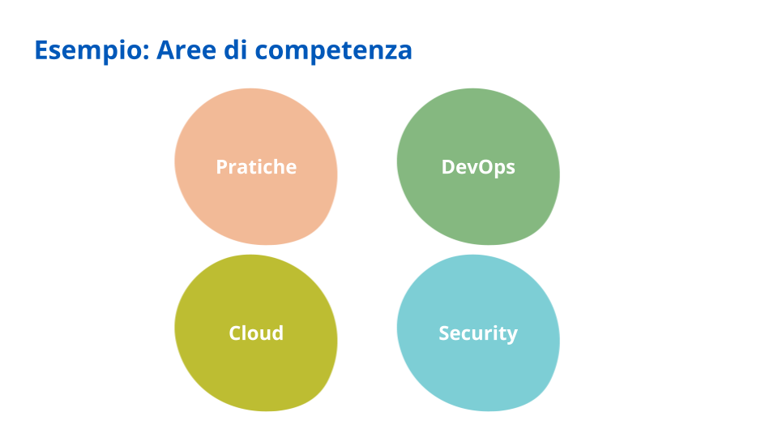
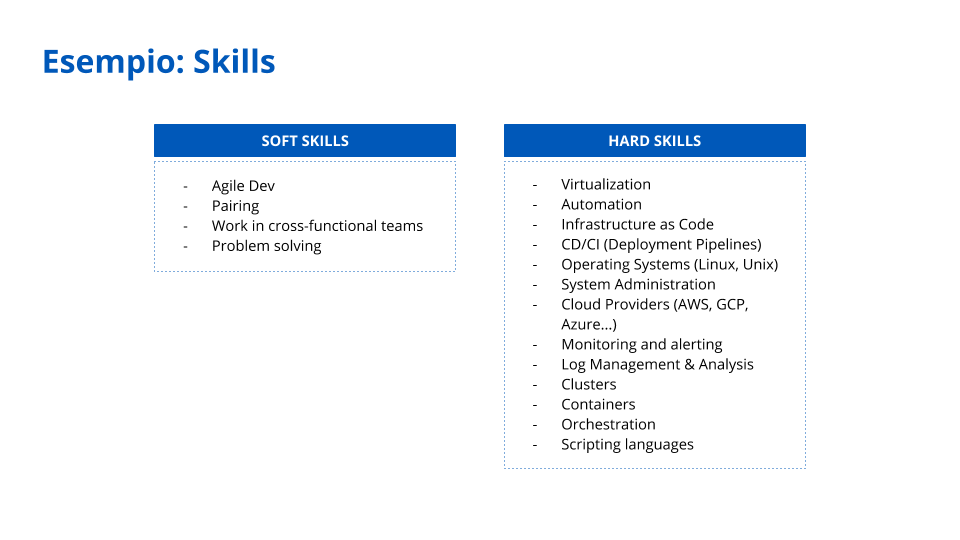

4.2 Le competenze necessarie 
=============================

Come abbiamo spiegato all’inizio di questo documento (vedi capitolo
2.3), iniziare una migrazione verso il cloud è un problema complesso i
cui fattori sono correlati tra loro da relazioni non causali. Tutti i
fattori devono perciò essere presi in considerazione prima di decidere
da dove e come partire. A seconda del proprio contesto, delle proprie
persone e delle loro competenze, ciascuna pubblica amministrazione dovrà
valutare qual è il giusto punto di partenza bilanciando i diversi
fattori e rimanendo pronta a reagire ed iterare a seconda dei risultati
raggiunti.

| Per questo motivo, in questo sottocapitolo forniamo uno strumento per
  abilitare la valutazione delle competenze interne alla pubblica
  amministrazione rispetto a quelle necessarie per eseguire una
  migrazione. L’obiettivo è quello di aiutare le amministrazioni ad
  individuare le competenze mancanti internamente ed avere chiarezza su
  cosa acquisire o cercare da eventuali fornitori che le supporteranno
  nella migrazione al cloud.
| Prima di presentare lo strumento in dettaglio, descriviamo qui anche
  il processo con il quale esso è stato creato. In questo modo, infatti,
  l’amministrazione potrà scegliere se usare il framework fornito o
  replicare il processo per costruire uno strumento ancora più specifico
  e adatto al proprio contesto e alle proprie esigenze.

4.2.1 Definizione delle competenze necessarie
---------------------------------------------

A seconda della strategia di migrazione scelta, saranno necessarie
diverse competenze per poter portare a termine la migrazione con
successo. Per valutare ed eventualmente acquisire le competenze
necessarie per eseguire la migrazione, i passi da fare sono:

1. definizione delle competenze necessarie per la strategia scelta

2. valutazione interna delle competenze che il team dell’amministrazione
   già possiede

3. identificazione delle competenze da ricercare all’esterno tramite il
   coinvolgimento di fornitori o un’appropriata formazione del personale
   interno

Per quanto riguarda il primo passo, ovvero la definizione delle
competenze necessarie, nella sezione 4.2.3 troverete uno strumento che
presenta un set di competenze necessarie già definite che possono essere
usate dall’amministrazione come punto di partenza per la valutazione.

Tuttavia, per poter definire le competenze necessarie è buona norma
coinvolgere il team dell’amministrazione che sarà più vicino ai progetti
di migrazione, in particolare quello tecnico, se presente. Con questo
team, si consiglia di organizzare una o più sessioni in cui i
partecipanti potranno contribuire in modo collaborativo allo scopo di
definire:

1. | **le aree di competenza necessarie**: macrocategorie che
     raggruppano una serie di skills, ad esempio come mostrato
     nell’immagine

2. **le skill per ognuna delle aree di competenza individuate**: divise
   in skill non-tecniche (ad es. di stampo metodologico e comunicativo)
   e tecniche, ad esempio come mostrato nell’immagine e che verranno poi
   distribuite nelle aree di competenza individuate

Una volta definite le aree di competenza e le skills che le compongono,
il passo successivo consiste nell’effettuare una valutazione interna
sulle singole skills. Questo può essere fatto mappando le competenze con
un modello di maturità che permetta al team dell’amministrazione di
evidenziare su quali ambiti sono già competenti e su quali invece sarà
necessario un supporto esterno o una formazione specifica.

4.2.2 Mappare le competenze secondo un modello di maturità
----------------------------------------------------------

Mappare le competenze interne con un modello di maturità aiuta ad
ottenere un quadro realistico dei diversi livelli della loro padronanza
da parte del team a oggi e facilita la pianificazione per il loro
sviluppo o per la loro acquisizione, se totalmente assenti, in futuro.

Tornando al processo illustrato sopra, una volta identificate le aree di
competenza e le rispettive skills necessarie, il team
dell’amministrazione deve ora procedere alla valutazione di ciascuna
skill secondo cinque livelli (basati sul `modello di
Dreyfus <https://apps.dtic.mil/dtic/tr/fulltext/u2/a084551.pdf>`__):

1. **principiante**: se non si ha nessuna o pochissima conoscenza della
   competenza in questione e sono necessarie guida e istruzioni precise
   per essere produttivi con questa skill

2. **principiante avanzato**: se si ha una certa autonomia
   nell’applicazione della skill in maniera situazionale, ma sempre
   tramite il supporto di guida e istruzioni

3. **intermedio**: se si ha una conoscenza sufficientemente profonda
   delle regole associate alla skille e si possono raggiungere obiettivi
   concreti in maniera autonoma

4. **competente**: se si ha una visione d’insieme e si è in grado di
   fare scelte sulla base del contesto e dell’esperienza, le istruzioni
   sono usate come fallback

5. **esperto**: se si fa affidamento sull’esperienza ancor più che sulle
   regole e si ha dunque un approccio maturo, efficiente ed orientato
   all’obiettivo

Per avere una visione d’insieme e immediata delle competenze con i
diversi livelli di maturità, si può poi costruire un `diagramma di
Kiviat <https://apps.dtic.mil/dtic/tr/fulltext/u2/a084551.pdf>`__
(conosciuto anche come grafico ragnatela o spider chart). Con un grafico
di questo tipo si riescono a mostrare in un’unica rappresentazione:

-  **le aree di competenza**: marcate sul grafico come parti della
   circonferenza, ovvero insiemi di raggi

-  **le diverse skill**: i raggi del grafico, che hanno tutti origine
   dallo stesso centro

-  **il livello di competenza di ciascuna skill**: marcato con un punto
   sul raggio proporzionale al livello della skill rispetto al massimo
   livello (ovvero 5 = esperto) raggiungibile

-  **la situazione generale in cui l’amministrazione si trova in termini
   di skill possedute rispetto a skill carenti o assenti**: congiungendo
   i punti sui raggi con segmenti si ottiene infatti il famoso grafico a
   forma di ragnatela utile per una valutazione immediata della
   situazione attuale

Un esempio di questo tipo di grafico è presentato nell’immagine sotto,
dove:

-  devops, practices, security e cloud sono le aree di competenza

-  continuous delivery, deployment automation, ecc. sono le diverse
   skill

-  con i numeri da 1 a 5 sono i diversi livelli che possono essere
   marcati

.. figure:: media/image16.png
   :alt: immagine 16

4.2.3 Strumento per la valutazione delle competenze 
----------------------------------------------------

Come anticipato sopra, proponiamo qui uno strumento che presenta un set
di competenze necessarie già definite che possono essere usate
dall’amministrazione come punto di partenza per la valutazione della
propria situazione in termini di competenze per il cloud.

Consigliamo alle amministrazioni di utilizzare il file creato (vedi
allegato “`Valutazione competenze <https://drive.google.com/open?id=1_5aEEDg4TGDEJB8EM5ZQqb6XgGtCxISLRFa_-l2BscU>`_”) per iniziare il proprio assessment
che potrà essere eseguito sia in maniera autonoma da ogni singolo
componente del team, evidenziando così le peculiarità di ognuno, sia
valutando le competenze come team.

Il documento è suddiviso in diversi fogli:

-  **Modifica skills:** foglio master per gli altri fogli del documento
   e che contiene tutti i nomi delle skills sulle quali verrà fatto
   l’assessment assieme alle loro descrizioni ed una valutazione del
   livello minimo per ogni strategia di migrazione, espresso su una
   scala da 0 a 5 dove:

   -  0 = non necessaria

   -  1 = principiante

   -  2 = principiante avanzato

   -  3 = intermedio

   -  4 = competente

   -  5 = esperto

-  **Assessment:** foglio dove il team può procedere alla valutazione
   delle proprie competenze sfruttando la colonna verde **Competenze** e
   selezionando il valore più appropriato tra quelli riportati

-  **Valutazione Retire, Re-purchase, Re-host, Re-platform,
   Re-architect:** ognuno di questi fogli riporta un diagramma di Kiviat
   (o spider chart) che mette a confronto i valori delle competenze
   risultanti dall’assessment con quelli considerati minimi per la
   strategia di migrazione che si sta osservando. In questo modo sarà
   possibile visualizzare a colpo d’occhio le skills su cui si ha un gap
   di competenze e sulle quali è quindi necessario un supporto esterno o
   di formazione. Si noti che non è inclusa la strategia di Retain in
   quanto non richiede azioni (dunque competenze) specifiche.
