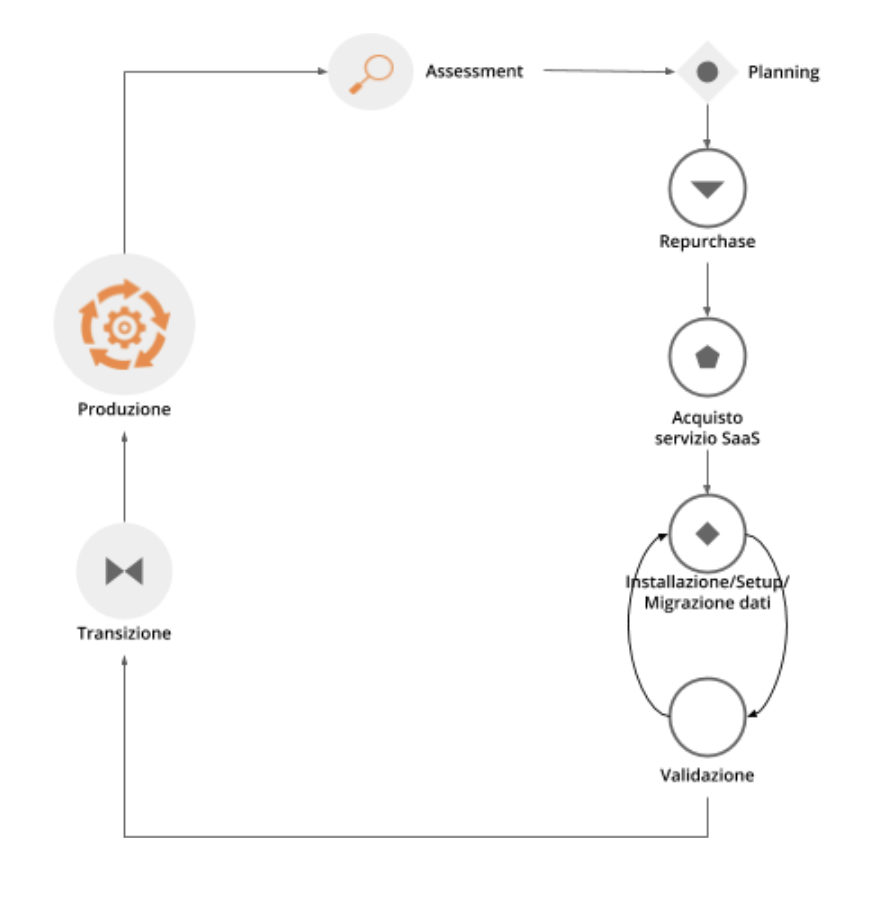
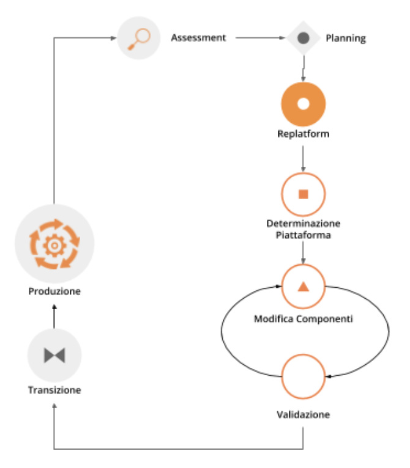

4.1 Le strategie di migrazione
==============================

Le principali strategie adottate per la migrazione di applicativi al
cloud sono note come le 6R:

-  Retain o Conservazione

-  Retire o Smantellamento

-  Re-purchase o Sostituzione

-  Re-host o Trasferimento di host

-  Re-platform o Trasferimento di piattaforma

-  Re-architect o Rifattorizzazione/Creazione di una nuova architettura

Ogni strategia si differenzia dalle altre per valore generato
e per risorse necessarie alla sua realizzazione. É quindi
necessario identificare le strategie applicabili alla migrazione di un
applicativo in base al livello di ambizione cui si aspira ed alle
effettive risorse che si possono utilizzare: non esiste *la strategia
corretta* ma il giusto bilanciamento di queste due componenti in base al
contesto in cui si opera.

.. figure:: media/image9.png
   :alt: immagine 9

Il valore generato da una migrazione può essere
espresso in termini di risparmio sui costi dell’infrastruttura e della
sua gestione, agilità nelle operazioni di configurazione dei servizi,
velocità di approvvigionamento, tempestività di adattamento
al variare dei bisogni reali del servizio (scalabilità delle
risorse in base al traffico, dimensionamento in base al numero di
operatori effettivi o al consumo necessario per le esigenze di
business).

In base al valore che si vuole ottenere, è altresì richiesto un livello
direttamente proporzionale di risorse in termini temporali, finanziari e
di competenze supportati da un approccio strategico adeguato.

In questo capitolo descriveremo in dettaglio ogni strategia di
migrazione, fornendo per ciascuna di esse:

-  definizione

-  benefici e rischi connessi

-  criteri di applicabilità

-  indicazione dei campi specifici e dei loro valori all’interno della
   scheda di assessment (vedi capitolo 3.2), che identificano la
   strategia come applicabile per un determinato applicativo

È infine importante reiterare il concetto che un applicativo spesso avrà
più di una strategia di migrazione applicabile. L’obiettivo di questa
fase è di identificare lo spettro di strategie di migrazioni possibili
per l’applicativo in analisi. La scelta finale su quale strategia
utilizzare dipenderà da diversi fattori quali la capacità di
investimento sul processo, il valore generato, le tempistiche, le
competenze e tutte quelle considerazioni da fare negli step successivi
del processo (ovvero con l’analisi costi-benefici e la valutazione delle
competenze) come illustrato nel capitolo 2.3.

4.1.1 Conservazione o Retain
----------------------------

La strategia di conservazione o retain consiste nel prendere la
decisione consapevole di non migrare in cloud un determinato applicativo
e di mantenerlo attivo sulla propria infrastruttura on-premise definendo
una nuova data in cui rivalutare i fattori che hanno portato a questa
decisione e nel caso non fossero più attuali procedere con la migrazione
in cloud dell’applicativo tramite una delle altre strategie presentate
in questo capitolo.

Questa decisione può essere guidata da diversi fattori: strategici, di
incompatibilità con le attuali piattaforme cloud o di assenza di
software alternativi in SaaS (vedi capitolo 1.1).

**Criteri di applicabilità della strategia**

Le principali caratteristiche che permettono di identificare gli
applicativi candidati alla strategia di retain o conservazione sono:

-  forte dipendenza dalla connettività che può portare ad un degrado
   eccessivo dell’esperienza utente nella fruizione da cloud

-  recente acquisizione con quota di ammortamento importante riferita ad
   un investimento in corso

-  basso impatto sulla strategia digitale dell’amministrazione non ne
   giustificano un redesign completo o parziale (Re-architect)

-  forte obsolescenza tecnologica non supportata da cloud service
   provider che rende il trasferimento di hosting (Re-host) o
   piattaforma (Re-platform) non possibili

-  assenza di un’alternativa SaaS che soddisfi le richieste
   dell’amministrazione

-  requisiti di sicurezza e privacy dei dati personali per cui
   l’amministrazione preferisce mantenere la parte dei dati soggetta a
   tali requisiti on-premise e trasferire in cloud solo la parte con
   minori vincoli

**Caratteristiche peculiari sulla scheda di assessment
dell'applicativo**

Rispetto alla scheda di assessment dell'applicativo compilata nella fase
di assessment vi sono determinate caratteristiche che rendono un
servizio candidabile per questa strategia

-  Connettività minima necessaria = rete locale

-  Evoluzione del servizio nei prossimi 3 anni per valutare se l’impatto
   sulla strategia dell’amministrazione è basso

-  Stack tecnologico per valutare l’obsolescenza tecnologica

-  Alternative SaaS = nessuna

-  Misure di sicurezza per valutare se come amministrazione si ritiene
   ci siano motivazioni valide per la conservazione on-premise

-  Licenze per valutare se l’investimento su una licenza valida
   on-premise non sia recuperabile o trasferibile con una corrispondente
   licenza in cloud

4.1.2 Smantellamento o Retire
-----------------------------

La strategia di smantellamento o retire consiste nell’identificare gli
applicativi che non sono più utili e possono essere spenti per
focalizzare l’attenzione sulle risorse che sono maggiormente utilizzate.

Sono da considerarsi come “non più in uso” anche quegli applicativi il
cui beneficio per l’amministrazione pubblica è inferiore ai costi
complessivi di mantenimento ed il cui utilizzo è limitato ad un insieme
predefinito e ricorrente di funzionalità con bassa frequenza.

Per questi la strategia di smantellamento deve definire, per le
necessità ancora presenti e non più coperte dalle funzionalità
dell’applicativo da dismettere, le modalità di espletamento dopo lo
smantellamento, definendo anche approcci manuali o semi-manuali.

La dismissione di un applicativo necessita di una verifica sugli
utilizzi da parte di operatori o dipendenze verso altri sistemi non noti
ma in realtà ancora attivi. Per questa verifica è possibile prevedere un
periodo significativo di spegnimento del sistema con possibilità di
riaccensione, in cui monitorare eventuali segnalazioni di
malfunzionamenti o di impossibilità a completare attività.

**Benefici**

-  eliminazione dell’infrastruttura a supporto dell’applicativo e delle
   sue attività di gestione

-  eliminazione della necessità di ruoli di supporto specializzato su
   applicativi `legacy <https://it.wikipedia.org/wiki/Sistema_legacy>`__

-  focalizzazione dell’attenzione sulle risorse che sono maggiormente
   utilizzate

**Rischi**

-  adattamento dei processi interni

**Criteri di applicabilità della strategia**

Le principali caratteristiche che permettono di identificare gli
applicativi candidati alla strategia di retire o smantellamento sono:

-  applicativi non più utili

-  applicativi rimpiazzati da versioni più moderne e mantenuti attivi al
   solo scopo di rendere possibile l’accesso a dati storici che non sono
   stati migrati ai nuovi sistemi

-  applicativi che non generano più nuovi dati

-  applicativi utilizzati per creare report su dati storici

-  applicativi la cui dismissione è stata procrastinata in quanto
   precedentemente non vi erano le condizioni per procedere, ad es. in
   termini di tempo, budget o competenze

**Caratteristiche peculiari sulla scheda di assessment
dell'applicativo**

Rispetto al scheda di assessment dell'applicativo compilata nella fase
di assessment vi sono determinate caratteristiche che rendono un
servizio candidabile per questa strategia

-  Frequenza di consultazione dei dati

-  Se la frequenza di aggiornamento dei dati è zero ed il ciclo di vita
   si è concluso, è possibile smantellare rimuovendo anche i dati

-  Se la frequenza di aggiornamento dei dati è zero ma quella di
   consultazione non lo è, allora è possibile smantellare l’applicativo
   migrando i dati in cloud

-  Evoluzione del servizio nei prossimi 3 anni per valutare se l’impatto
   sulla strategia dell’amministrazione è basso

-  Applicativi che trattano gli stessi dati per valutare se qualche
   applicativo tratta lo stesso insieme di dati e quindi può essere
   considerato come sostituto

-  Periodi di utilizzo, # medio di utenti, # massimo di utenti, # minimo
   di utenti unici giornalieri negli ultimi 12 mesi per valutare se
   l’utilizzo è assente o non rilevante

4.1.3 Sostituzione o Re-purchase
--------------------------------

I prodotti software sono fruibili principalmente attraverso due
modalità:

1. on-premise: scaricando, installando e configurando il pacchetto
   software sulla propria infrastruttura

2. come Software as a Service (SaaS), ovvero accedendo ed utilizzando
   direttamente il prodotto, tipicamente attraverso un browser o un’app,
   senza alcuna responsabilità infrastrutturale o manutentiva

La strategia di Re-purchase consiste nel **rimpiazzare un applicativo
installato e gestito on-premise con la controparte SaaS**.

Possiamo rappresentare questa strategia con il seguente diagramma:

Se un applicativo on-premise non ha un’alternativa SaaS fornita dal
medesimo produttore, bisogna procedere con un benchmark comparativo per
identificare un’alternativa secondo `le linee guida su acquisizione e
riuso di software per le pubbliche
amministrazioni <https://lg-acquisizione-e-riuso-software-per-la-pa.readthedocs.io/it/latest/>`__
e in ogni caso adottando `il principio “Cloud
First” <https://buildmedia.readthedocs.org/media/pdf/cloud-italia-docs/latest/cloud-italia-docs.pdf>`__.

Applicativi in modalità SaaS offrono modelli di pricing generalmente
basati su sottoscrizioni invece di licenze come nel mondo on-premise:
non è possibile l’acquisto di licenze perpetue ma sono diffuse
sottoscrizioni con cadenza mensile o annuale basate su utilizzatori o
consumo effettivo.

Esempi di servizi che è possibile migrare su SaaS:

-  Posta elettronica

-  File Server per la condivisione dei file

-  ERP

**Benefici**

-  eliminazione dell’infrastruttura a supporto dell’applicativo e delle
   sue attività di gestione

-  minori costi iniziali

-  tempo di fermo per gli aggiornamenti dei sistemi ridotto

-  accessibili da qualunque device connesso ad internet

-  facilmente e tempestivamente adattabile alle variazioni delle
   necessità di business, ad es. n. di operatori cui garantire l’accesso
   (per user), livello di funzionalità disponibili (feature based),
   quota di risorse (per storage/transaction)

-  no setup, accesso immediato

**Rischi**

-  lock-in con il cloud service provider (vedi capitolo 4.3)

-  migrazione dati verso un modello dati differente

-  migrazione dei punti di integrazione (es. API) verso contratti
   differenti

-  integrazione/riconfigurazione dei servizi SaaS con servizi on-premise
   (es. autentica)

-  assenza di controllo in caso di down

-  `total cost of ownership
   (TCO) <https://it.wikipedia.org/wiki/Total_Cost_of_Ownership>`__
   potrebbe essere maggiore sul lungo periodo

**Criteri di applicabilità della strategia**

**Identificazione della categoria dell’applicativo**

La categoria di un applicativo riflette tipicamente il principale
bisogno soddisfatto dalla sua applicazione. Non vi è una classificazione
di riferimento, univoca e stringente delle soluzioni software, per cui
l’identificazione deve utilizzare approssimazioni basate sui principali
bisogni indirizzati, e sulle più diffuse classificazioni nel mercato. In
un mercato ad alta innovazione è altresì possibile che nuovi prodotti
definiscano nuove categorie che superano o specializzano quelle
precedenti.

Esempi di categorie di software con opzioni SaaS disponibili sul
catalogo dei servizi Cloud per la PA qualificati sono:

-  CMS, Content Management Systems

-  ERP, Enterprise Resource Planning

-  LMS, Learning Management System

-  Project Management

-  Email Management Software

-  File Sharing

-  Collaborazione e Produttività

-  Software amministrativi

-  Gestione tributi

**Caratteristiche peculiari sulla scheda di assessment
dell'applicativo**

Rispetto al scheda di assessment dell'applicativo compilata nella fase
di assessment vi sono determinate caratteristiche che rendono un
servizio candidabile per questa strategia:

-  Alternative SaaS

-  Disponibilità di import dei dati

Lo sviluppo del mercato dei prodotti software verso la modalità SaaS,
offre un costante aumento di soluzioni in cloud che possono rimpiazzare
software precedentemente disponibile solo on-premise con la
corrispondente versione cloud-based realizzata dal medesimo produttore o
con soluzioni equivalenti o migliorative proposte da nuovi soggetti.

La verifica di tali alternative può essere fatta sul catalogo dei
servizi cloud qualificati da AGID `(Cloud Marketplace) <https://cloud.italia.it/marketplace>`__, la piattaforma
che espone i servizi e le infrastrutture qualificate.

All'interno del Cloud Marketplace è possibile ricercare i servizi e
visualizzarne la scheda tecnica che mette in evidenza le caratteristiche
tecniche, il modello di costo e i livelli di servizio dichiarati dal
fornitore in sede di qualificazione.

A decorrere dal 1 aprile 2019, le pubbliche amministrazioni potranno
acquisire esclusivamente servizi IaaS, PaaS e SaaS qualificati da AgID e
pubblicati nel cloud Marketplace.

4.1.4 Trasferimento di host o Re-host
-------------------------------------

Anche detta strategia di *Lift & Shift*, consiste nel prendere (Lift)
l’intero servizio, compreso di infrastruttura, architettura, dati e
traffico e spostarlo su un hosting cloud (Shift) senza modifiche al core
dell’applicativo. Spesso il re-host è una strategia che permette di fare
un primo step verso il cloud valutando poi successivamente ulteriori
miglioramenti all’applicativo che permettano di sfruttare ulteriormente
i vantaggi del cloud.

Possiamo rappresentare questa strategia con il seguente diagramma:

.. figure:: media/image11.png
   :alt: immagine 11

La strategia può essere eseguita in due modi:

1. **automatizzata** tramite strumenti di migrazione

2. **manuale**

La migrazione automatizzata in presenza di strumenti di migrazione
forniti dal cloud service provider e dai suoi partner è da considerarsi
preferibile rispetto alla manuale perchè fornisce una strutturazione al
processo, riduce le possibilità di errori, trae vantaggio dalle
caratteristiche intrinseche della soluzione cloud cui si migra.

La strategia manuale è preferibile solo a fronte dell’impossibilità di
procedere in modo automatico con strumenti maturi ed affidabili o a
fronte di ben identificati obiettivi, come, ad esempio, permettere al
team di familiarizzare con il cloud, migliorando così la propria
competenza interna attraverso una delle strategie di migrazione più
semplici.

**Rehost automatizzato**

I cloud service provider più diffusi forniscono la possibilità di
migrare gli applicativi tramite l’utilizzo di strumenti dedicati,
sviluppati internamente o forniti da partner esterni, che permettono di
automatizzare l’intero processo di migrazione.

Questi strumenti sono solitamente divisi in 2 categorie:

1. **strumenti di migrazione dei server**: trasferiscono un’intera
   macchina fisica o virtuale su una corrispondente macchina in cloud

2. **strumenti di migrazione dei database**: trasferiscono i dati
   presenti da un database on-premise ad uno in cloud

Generalmente il processo associato all’utilizzo di questi strumenti
rispecchia i seguenti passi:

1. **installazione** di un software agente sulla macchina o collegamento
   al database da migrare

2. **definizione delle specifiche in cloud** della macchina o database
   di destinazione

3. **replica** della macchina o database, con entrambe le versioni
   funzionanti e dati sincronizzati

4. **testing** della replica, verificando che la macchina in cloud
   rifletta esattamente la sorgente migrata o che i dati su database
   siano corretti

5. **cut-over** dove gli utenti utilizzatori della macchina o database
   iniziale vengono reindirizzati verso quelli migrati in cloud

**È sempre necessario fare riferimento alla documentazione dei singoli
strumenti per ulteriori dettagli.**

**Rehost manuale**

Ogni migrazione ha delle sue particolarità relative all’applicativo,
l’infrastruttura, il team e l’organizzazione cui è applicata, ma
possiamo generalizzare le procedure di rehosting manuale a questa serie
di step:

1. **virtualizzazione** della macchina che ospita l’applicativo

2. **replica della macchina virtuale** sul nuovo servizio cloud

3. **sincronizzazione dei dati** tra Virtual Datacenter e cloud

4. **testing e validazione** del funzionamento del nuovo ambiente

5. **cut-off del traffico** e reindirizzamento verso il nuovo
   applicativo

**Benefici**

-  ricchezza di strumenti di supporto: il mercato offre diversi
   strumenti per automatizzare il processo rendendolo più affidabile e
   solido

-  riuso di competenze diffuse: le competenze sviluppate in ambito
   sistemistico e di gestione di infrastrutture virtualizzate on-premise
   sono sufficienti per poter procedere

-  tempistiche di migrazione inferiori in media rispetto a
   re-purchasing, re-platforming e re-architecting

-  riduzione delle risorse utilizzate a livello di infrastruttura e
   delle attività per la loro gestione

-  dismissione delle risorse on-premise e costi associati

-  maggiore possibilità di procedere con re-platform da un re-host
   grazie alla conoscenza della soluzione cloud acquisita durante la
   migrazione, la riduzione della complessità del sistema ottenuta dal
   passaggio da on-premise a cloud, la possibilità di creare ambienti di
   testing con effort molto ridotto

**Rischi**

-  sovradimensionamento delle risorse: gli applicativi on-premise
   vengono solitamente dimensionati sulla base dei picchi di carico
   previsti, sovradimensionando quindi l’infrastruttura rispetto
   all’utilizzo abituale. Fare re-host senza riconsiderare il
   dimensionamento può comportare un’allocazione non necessaria di
   risorse con conseguente impatto sui costi.

-  mancato sfruttamento di tutte le potenzialità del cloud:
   l’applicativo è migrato con la configurazione dell’ambiente
   on-premise e richiede una riconfigurazione degli aspetti di
   scalabilità orizzontale e verticale per sfruttare l’elasticità
   disponibile in un ambiente cloud. Il re-host deve essere
   principalmente solo un punto di partenza in una strategia evolutiva
   dell’applicativo/servizio che punti al raggiungimento di livelli di
   valore più alti.

-  aumento della latenza dell’applicativo a causa di una differente
   connettività

**Criteri di applicabilità della strategia**

Le principali caratteristiche che permettono di identificare gli
applicativi che possono adottare una strategia di migrazione in cloud di
tipo re-host sono:

-  applicativi con codice sorgente proprietario di terze parti che non
   hanno una roadmap evolutiva tendente al cloud in medio o breve
   termine

-  soluzioni monolitiche per cui non è possibile sostituire le singole
   componenti applicative in una progressiva trasformazione finalizzata
   a sfruttare più propriamente le soluzioni cloud based

-  soluzioni legacy basate su tecnologie obsolete

-  applicativi con molte integrazioni con prodotti, servizi o librerie
   di terze parti

-  alto impatto sulle risorse infrastrutturali

-  soluzioni stagnanti che hanno raggiunto una stabilità evolutiva ed
   hanno una bassissima frequenza di aggiornamenti

**Caratteristiche peculiari sulla scheda di assessment
dell'applicativo**

Rispetto al scheda di assessment dell'applicativo compilata nella fase
di assessment vi sono determinate caratteristiche che rendono un
servizio candidabile per questa strategia

-  Modificabilità del codice sorgente = no

-  Uso di componenti sostituibili con l’equivalente servizio cloud
   native = nessuno

-  Stack tecnologico per valutare l’obsolescenza tecnologica

-  Sistemi on premise da cui dipende per valutare la complessità
   generata dalle dipendenze e l’impatto sul processo di migrazione

-  Sistemi on premise che dipendono per valutare la complessità generata
   dalle dipendenze e l’impatto sul processo di migrazione

-  Connettività minima necessaria = internet

-  Licenze per valutare se l’investimento su una licenza valida
   on-premise sia recuperabile o trasferibile con una corrispondente
   licenza in cloud

-  Evoluzione del servizio nei prossimi 3 anni per valutare se l’impatto
   sulla strategia dell’amministrazione è basso

Queste caratteristiche evidenziano applicativi che risultano molto
difficili da trasformare sia per possibilità tecnica che per rischio di
efficacia, che hanno un impatto importante sull’attuale infrastruttura e
che in generale possono essere migrati così come sono in quanto poco
strategici nella roadmap futura.

4.1.5 Trasferimento di piattaforma o Re-platform
------------------------------------------------

La strategia di Re-platform oltre a trasferire un applicativo sul cloud
come nel re-host, sostituisce nel processo di migrazione alcune
componenti per meglio sfruttare le specificità della piattaforma di
destinazione.

Possiamo rappresentare questa strategia con il seguente diagramma:

Esempi di sostituzione sono:

-  i bilanciatori di carico che sui sistemi on-premise sono tipicamente
   macchine virtuali mentre in cloud sono disponibili come servizio
   gestito. Questa sostituzione permette di risparmiare sul numero di
   macchine virtuali e conseguentemente su costi e gestione

-  il database management system on-premise con la versione
   completamente gestita in cloud per migliorare la resilienza della
   base dati sfruttando la disponibilità e semplicità di configurazione
   dei meccanismi di scalabilità, ridondanza, backup, patching,
   sicurezza, data encryption, hardware fault tolerance e monitoring

-  l’ambiente di runtime attraverso l’utilizzo di container, ad es.
   Docker, per delegare la gestione di memoria, cpu e storage alla
   piattaforma cloud semplificando gli aspetti manutentivi e aumentando
   la portabilità fra diversi cloud service provider riducendo quindi il
   rischio di lock-in

-  l’esecuzione dei batch demandata ai servizi specifici del cloud
   service provider per una riduzione dell’impatto manutentivo, del
   consumo di risorse ed una migliore scalabilità

-  lo storage per i file on-premise con l’equivalente servizio in cloud
   per sfruttare la capacità elastica, la robustezza, i meccanismi di
   sincronizzazione e gestione del ciclo di vita del dato e la
   modulazione dei costi in base alla frequenza di accesso al dato
   stesso di quest’ultimo

**Benefici**

-  maggiore riduzione delle risorse utilizzate a livello di
   infrastruttura e delle attività per la loro gestione rispetto al
   re-host nel breve periodo

-  migliore sfruttamento delle caratteristiche proprie del cloud come
   disponibilità, scalabilità, osservabilità, resilienza, provisioning
   delle risorse

-  sviluppo di una conoscenza più profonda del cloud e dei servizi che
   offre senza modifiche radicali al software

**Rischi**

-  difficoltà nel reperire le competenze necessarie per le
   trasformazioni che si vogliono operare, principalmente legate alla
   conoscenza dei sistemi in cloud e alle tecniche di refactoring.

-  aumento del rischio di instabilità dell’applicativo in caso di
   trasformazioni multiple contemporanee: è altamente raccomandato di
   prioritizzare solo le trasformazioni che portano ad un beneficio
   tangibile ed applicarle in modo iterativo e controllato per validarne
   l’effetto.

**Criteri di applicabilità della strategia**

Le principali caratteristiche che permettono di identificare gli
applicativi che possono adottare una strategia di migrazione in cloud di
tipo re-platform sono:

-  componenti separabili come ad esempio nelle architetture a 3 livelli
   o Three-tier dove logica di presentazione, logica di business e dato
   sono ben distinte

-  utilizzo di servizi esterni sostituibili (ad esempio servizio SMTP o
   di autenticazione)

-  necessità di migliorare la scalabilità

-  frequenti modifiche

**Caratteristiche sul scheda di assessment dell'applicativo**

Rispetto al scheda di assessment dell'applicativo compilata nella fase
di assessment vi sono determinate caratteristiche che rendono un
servizio candidabile per questa strategia:

-  Stack tecnologico per valutare architetture modulari e a componenti
   separabili

-  Uso di componenti sostituibili con l'equivalente servizio
   cloud-native

-  Periodi di utilizzo per valutarne la variabilità e confronto tra #
   medio di utenti e # massimo e minimo di utenti con l’obiettivo di
   identificare scostamenti rilevanti

-  Utilizzo effettivo delle componenti infrastrutturali in confronto al
   dimensionamento delle componenti infrastrutturali per valutare un
   sovra o sotto dimensionamento

-  Evoluzione del servizio nei prossimi 3 anni per valutarne
   l’importanza e l’opportunità di investimenti sull’applicativo

-  Dipendenza dall'hardware fisico = se virtuale o container

-  Connettività minima necessaria = internet

-  Modificabilità del codice sorgente = parziale o completa

-  Disponibilità di documentazione tecnica che supporti nella
   sostituzione delle componenti

-  Criticità legate a componenti sostituibili con un’alternativa cloud
   native

Queste caratteristiche evidenziano un applicativo con un’architettura
modulare, che utilizza componenti che possono essere sostituite con un
equivalente servizio gestito dal cloud service provider, di cui si può
modificare il codice sorgente per le parti di interfacciamento con tali
componenti grazie anche alla conoscenza derivata dalla documentazione
delle strutture interne.

Questi applicativi fanno parte della visione strategica
dell’amministrazione che giustifica l’investimento nella trasformazione.

4.1.6 Rifattorizzazione/Creazione di una nuova architettura o Re-architect
--------------------------------------------------------------------------

La strategia di Re-architect ha come obiettivo quello di ripensare
significativamente l’architettura core di un applicativo in ottica
cloud, attraverso un processo di redesign iterativo ed incrementale che
miri ad adottare appieno i servizi cloud-native offerti dai cloud
service provider per massimizzare i benefici che ne derivano.

Esempi di redesign dell’architettura riguardano:

-  l’adozione di *lambda-function* per scomporre un applicativo in
   modalità service-oriented sfruttando la capacità di autoscaling che
   dimensiona l’utilizzo sulla base del traffico effettivo

-  l’utilizzo di *API gateway* per definire ed esporre interfacce
   applicative pubbliche o ad accesso controllato per favorire
   l’interoperabilità con sistemi esterni

-  la trasformazione dell’applicativo in *componenti stateful e
   stateless*, ovvero con o senza stato interno persistente, per poter
   configurare lo scaling e l’availability in modo differenziato e
   sfruttare quindi in modo ottimale le risorse non essendo costretti ad
   un dimensionamento basato sul caso peggiore

-  la creazione di un layer di integrazione che permetta di rimuovere la
   necessità di duplicazione dei dati tra applicativi diversi,
   consentendone il recupero direttamente dalla sorgente primaria

La strategia di re-architect, rispetto alle altre viste finora, permette
di massimizzare lo sfruttamento delle potenzialità del cloud in termini
di scalabilità, ridondanza, continuità del servizio, costi
infrastrutturali e di gestione, ecc. Essa è al tempo stesso la più
complessa da condurre in quanto richiede una conoscenza specialistica
della piattaforma cloud utilizzata, ovvero principi di design
cloud-native, metodologie consolidate di test coverage, test automation,
refactoring o trasformazione del codice sorgente in modo controllato.

Possiamo rappresentare il re-architect con il seguente diagramma:

.. figure:: media/image13.png
   :alt: immagine 13

**Benefici**

-  maggiore riduzione delle risorse utilizzate a livello di
   infrastruttura e delle attività per la loro gestione rispetto a
   re-host e re-platform nel breve e medio periodo

-  ottimizzazione dei costi nel lungo termine grazie all’utilizzo delle
   risorse basato sull’effettiva necessità e non su quella prevista

-  migliore sfruttamento delle caratteristiche proprie del cloud come
   disponibilità, scalabilità, osservabilità, resilienza, provisioning
   delle risorse

-  miglioramento delle modalità di sviluppo e validazione attraverso
   strumenti avanzati per la sperimentazione come l’\ `A/B
   testing <https://it.wikipedia.org/wiki/Test_A/B>`__ e deployment
   indipendenti delle componenti applicative

-  responsività alle variazioni di carico impreviste grazie ad uno
   scaling in real time

-  incremento della sicurezza grazie alla disponibilità di funzionalità
   avanzate

**Rischi**

-  difficoltà nel reperire le competenze necessarie per le
   trasformazioni che si vogliono operare, principalmente legate alla
   conoscenza dei sistemi in cloud, tecniche di refactoring e principi
   di design di applicativi cloud native

-  aumento del rischio di instabilità dell’applicativo in caso di
   trasformazioni multiple contemporanee: è altamente raccomandato di
   prioritizzare solo le trasformazioni che portano ad un beneficio
   tangibile ed applicarle in modo iterativo e controllato per validarne
   l’effetto.

-  rischio di significativo lock-in con il cloud service provider

**Caratteristiche degli applicativi migrabili con re-architect**

Di seguito una lista di caratteristiche che permettono di identificare
gli applicativi la cui migrazione in cloud può essere preferibile con un
approccio re-architect:

-  centralità nella strategia di trasformazione digitale dell’ente

-  necessità di un ammodernamento tecnologico e riduzione del debito
   tecnico per facilitare evoluzioni future

-  bisogno di aumentare e ridurre la capacità di gestione del traffico
   per rispondere a necessità contingenti e variabili

-  necessità di adeguamento alle linee guida del nuovo modello di
   interoperabilità del sistema informativo della PA

**Caratteristiche sul scheda di assessment dell'applicativo**

Rispetto al scheda di assessment dell'applicativo compilata nella fase
di assessment vi sono determinate caratteristiche che rendono un
servizio candidabile per questa strategia

-  Evoluzione del servizio nei prossimi 3 anni per valutarne
   l’importanza e l’opportunità di investimenti sull’applicativo

-  Stack tecnologico per valutare la necessità di ammodernamento

-  Uso di componenti sostituibili con l'equivalente servizio
   cloud-native

-  Criticità per identificare opportunità di miglioramento strutturale
   della soluzione

-  Periodi di utilizzo per valutarne la variabilità e confronto tra #
   medio di utenti e # massimo e minimo di utenti con l’obiettivo di
   identificare scostamenti rilevanti

-  Utilizzo effettivo delle componenti infrastrutturali in confronto al
   dimensionamento delle componenti infrastrutturali per valutare un
   sovra o sotto dimensionamento

-  Connettività minima necessaria = internet

-  Modificabilità del codice sorgente = parziale o completa

-  Presenza di test di validazione per verificare il miglioramento
   apportato dalle modifiche intraprese e ridurre il rischio di
   regressione durante il processo

-  Disponibilità di documentazione tecnica che supporti il processo di
   rifattorizzazione

Queste caratteristiche evidenziano un applicativo centrale per la
visione strategica dell’amministrazione giustificandone l’investimento
in tempo, competenze e costi per un redesign dell’architettura possibile
grazie alla proprietà del codice sorgente o alla capacità di influenzare
la roadmap evolutiva definita dal produttore.
